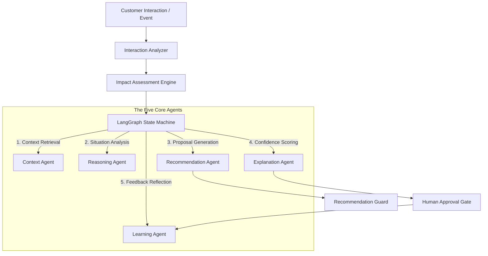

# Agent Specifications & Ecosystem

The platform coordinates **five core single-responsibility agents** alongside **two specialized intelligence engines**. Each agent is registered in the Agent Registry (`backend/registry/agent_registry.py`) and operates under strict input and output data contracts.

---

## 1. Agent Ecosystem & Execution Topology



---

## 2. Agent Registry Design (`agent_registry.py`)

Agents are registered dynamically at server startup via `bootstrap_agents()`:

```python
_agent_registry: Dict[str, BaseAgent] = {}

def register_agent(agent: BaseAgent) -> None:
    _agent_registry[agent.name] = agent

def get_agent(name: str) -> BaseAgent:
    if name not in _agent_registry:
        raise KeyError(f"Agent '{name}' not found in registry.")
    return _agent_registry[name]
```

This pattern ensures complete decoupling: nodes in `planner.py` invoke agents via `get_agent("context")` rather than instantiating hardcoded classes.

---

## 3. Core Agent Specifications

### 3.1 Context Agent (`context_agent.py`)
* **Role**: Gathers relevant domain playbooks, dynamic heuristics documents, and past case outcomes from semantic and episodic memory stores.
* **Retrieval Strategy**:
  1. Queries the active vector store (ChromaDB/Qdrant) using text similarity embeddings (`all-MiniLM-L6-v2`) against the entity's notes and current situation.
  2. Fetches historical decider choices (approved, edited, rejected) for similar entity ACV tiers and health scores from SQLite/PostgreSQL.
* **Input Contract**:
  - `domain_pack_id` (str): Domain identifier (e.g. `customer_success`).
  - `account` (dict): Selected entity metadata.
  - `interaction_notes` (str): Customer notes or event text.
* **Output Contract**:
  - `retrieved_documents` (list): Top matching playbooks with similarity distance metrics.
  - `similar_cases` (list): Historical feedback records for similar past accounts.
  - `dynamic_heuristics` (list): Mined guidelines from previous Learning Agent reflections.

---

### 3.2 Reasoning Agent (`reasoning_agent.py`)
* **Role**: Analyzes the raw situation text and retrieved context to identify operational risks, growth opportunities, and business conflicts.
* **Analysis Logic**:
  - Evaluates account health trends, renewal urgency, usage declines, and key contact changes.
  - Cross-references signals against playbook risk indicators.
  - Validates potential conflicts (e.g., attempting an upsell on a high churn-risk client).
* **Input Contract**:
  - `account` (dict): Entity state.
  - `retrieved_context` (dict): Output from Context Agent.
* **Output Contract**:
  - `risks` (list): Identified risk items with severity levels (e.g. `champion_loss`, `budget_freeze`).
  - `opportunities` (list): Growth indicators (e.g. `seat_expansion`).
  - `conflicts` (list): Detected operational contradictions requiring human attention.

---

### 3.3 Recommendation Agent (`recommendation_agent.py`)
* **Role**: Generates candidate action proposals, selects the optimal primary next-best action, and enforces safety guardrails.
* **Generation Strategy**:
  1. Maps identified risks and opportunities to playbook action templates.
  2. Rates candidate actions based on strategic alignment and estimated business impact.
  3. Passes candidate proposals to the **Recommendation Guard** (`recommendation_guard.py`) to verify claims against evidence citations and rewrite absolute statements.
* **Input Contract**:
  - `reasoning_output` (dict): Output from Reasoning Agent.
  - `domain_pack` (dict): Active domain playbooks and rules directory.
* **Output Contract**:
  - `recommended_action` (dict): Title, description, rationale, estimated metrics impact.
  - `candidates` (list): Alternative candidate proposals considered and rejected reasons.
  - `guardrail_status` (dict): Claim verification and tone rewrite details.

---

### 3.4 Explanation Agent (`explanation_agent.py`)
* **Role**: Computes metric-driven confidence scores and generates transparent, human-auditable reasoning steps.
* **Confidence Scoring Algorithm**:
  $$\text{Confidence} = (W_1 \times \text{Source Agreement}) + (W_2 \times \text{Evidence Count Factor}) + (W_3 \times \text{Historical Acceptance Rate})$$
  - **Source Agreement ($W_1 = 0.40$)**: Semantic similarity alignment between retrieved playbooks and the proposed action.
  - **Evidence Count Factor ($W_2 = 0.30$)**: Ratio of supporting evidence citations ($0$ to $5+$ sources).
  - **Historical Acceptance Rate ($W_3 = 0.30$)**: Ratio of past decider approvals for similar recommendations in episodic memory.
* **Input Contract**:
  - `retrieved_context` (dict): Retrieved documents and cases.
  - `recommendation_output` (dict): Proposed primary action.
* **Output Contract**:
  - `confidence_score` (float): Final score scaled between `0.0` and `1.0`.
  - `confidence_breakdown` (dict): Individual values for source agreement, evidence count, and historical acceptance.
  - `reasoning_trace` (list): Step-by-step handoff log for UI rendering.

---

### 3.5 Learning Agent (`learning_agent.py`)
* **Role**: Closed-loop optimizer that mines human decisions to continuously refine vector heuristics.
* **Mining Cycle**:
  1. Triggered post-approval or via `POST /api/v1/reflect`.
  2. Queries `FeedbackRecord` entries from episodic memory.
  3. Identifies trends in human edits and rejections.
  4. Formulates a new **Dynamic Heuristics Document** and upserts it into ChromaDB/Qdrant.
* **Input Contract**:
  - `domain_pack_id` (str): Domain pack namespace.
  - `human_decision` (dict): Outcome (`approved`/`edited`/`rejected`), comments, and modifications.
* **Output Contract**:
  - `heuristics_updated` (bool): True if vector memory was updated.
  - `mined_guideline` (str): Text of the auto-generated guideline.

---

## 4. Specialized Intelligence Engines

### 4.1 Interaction Analyzer (`interaction_analyzer.py`)
* **Purpose**: Real-time signal mining engine that processes incoming meeting notes, emails, support tickets, and call transcripts.
* **Keyword Arrays**: Uses curated domain keyword arrays (e.g. `champion_change`, `renewal_risk`, `usage_decline`, `salary_concern`).
* **Output**: Extracted signals array, severity level, and impact metrics.

### 4.2 Impact Assessment Engine (`impact_engine.py`)
* **Purpose**: Calculates operational delta metrics based on mined signals.
* **Calculated Deltas**:
  - **Renewal Risk Delta** (e.g. `+25%`)
  - **Churn Probability Delta** (e.g. `+20%`)
  - **Expansion Probability Delta** (e.g. `+15%`)
* **Impact Score**: Computes an aggregate `impact_score` (`0` to `100`).
