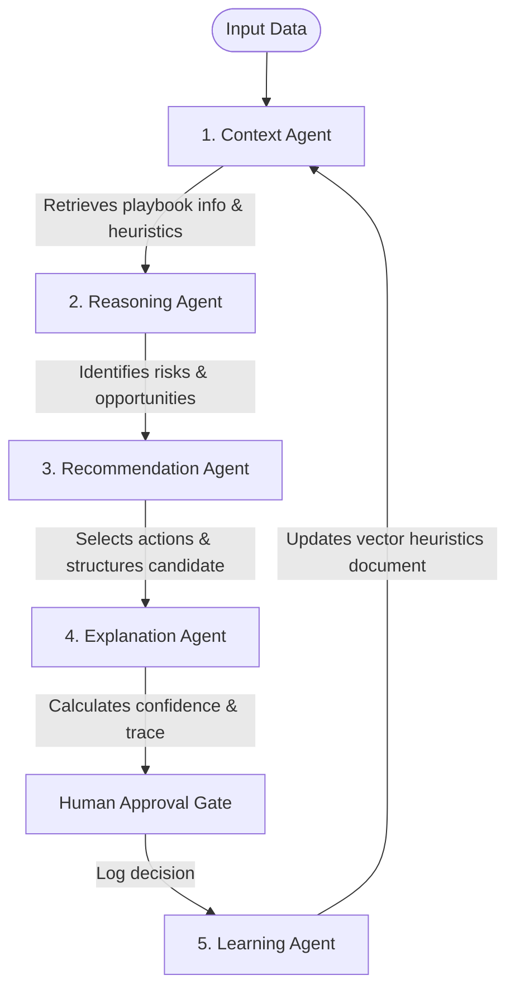

# The Five Agents

The platform coordinates five specialized, single-responsibility agents. Each is registered dynamically inside the Agent Registry and mapped to specific inputs and output contracts.

---

## Agent Flow & Interactions

---

## Agent Definitions and Data Contracts

### 1. Context Agent
* **Role**: Gather internal playbooks, dynamic heuristics, and past similar cases.
* **Input**: Domain ID, Account metadata, and raw text notes.
* **Output**: Retrieved documents, past case feedback outcomes, and correlation metrics.

### 2. Reasoning Agent
* **Role**: Analyze the raw signals and retrieved context to identify potential risks, opportunities, or operational conflicts.
* **Input**: Account stats, context matches, and raw text logs.
* **Output**: Lists of detected risks, potential opportunities, and a validation flag checking for conflicting priorities.

### 3. Recommendation Agent
* **Role**: Generate candidates based on playbook recommendations and select the best, high-value option.
* **Input**: Active risks/opportunities, domain-approved actions directory.
* **Output**: Selected primary action (title, description, rationale, estimated impact metrics) and candidates list.

### 4. Explanation Agent
* **Role**: Structure confidence scores and reasoning traces for explainability.
* **Input**: Context playbooks count, similar case acceptance records, and reasoning details.
* **Output**: Final confidence breakdown (score, source agreement, evidence count, historical acceptance) and sequence logic trace.

### 5. Learning Agent
* **Role**: Closed-loop optimizer mining approvals and rejections to update guidelines.
* **Input**: Approval decision inputs, edited recommendations, and historical feedback log.
* **Output**: Mined heuristics document containing guidelines for future runs.
