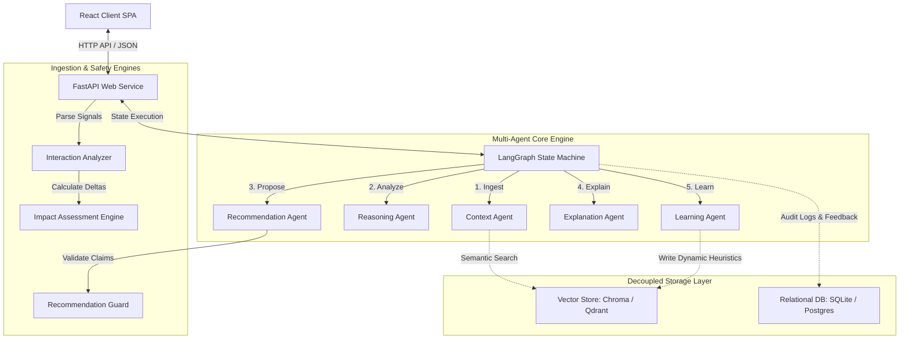
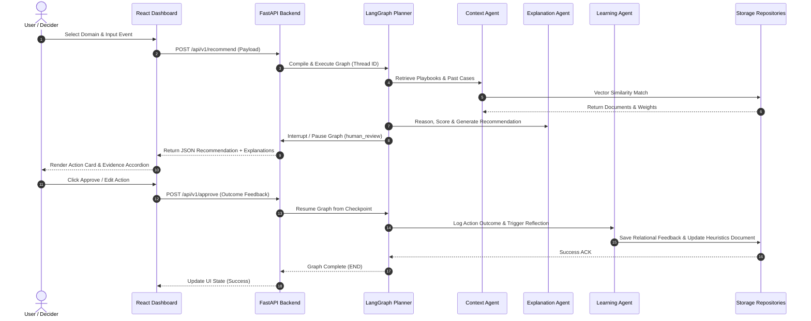

# System Architecture

The **Decision Intelligence Platform** is structured as an enterprise-grade, configuration-driven multi-agent platform designed for domain-agnostic decision automation, next-best-action generation, and closed-loop learning from human feedback.

---

## 1. Architectural Principles

1. **Configuration-Driven Domain Agnosticism**: Domain packs (such as Customer Success or Recruitment) define entity schemas, playbooks, success metrics, and prompts entirely in JSON/Markdown configuration files without changing application source code.
2. **Deterministic Human-in-the-Loop (HITL) Safety**: Execution pauses at a compiled LangGraph interrupt gate before recommendation fulfillment, requiring explicit human approval, modification, or rejection.
3. **Decoupled Memory Systems**: Isolates relational episodic history (SQLite/PostgreSQL) from vector semantic storage (ChromaDB/Qdrant) via abstract repository interfaces.
4. **Metric-Driven Explainability**: Recommendations carry metric-based confidence scores derived from playbook evidence citations, historical acceptance rates, and semantic relevance matching.
5. **Continuous Learning Loop**: Human choices are logged to episodic memory and mined by the Learning Agent to update dynamic heuristic vector documents, self-correcting future runs.

---

## 2. High-Level Architecture Block Diagram



---

## 3. Subsystem Breakdown

### 3.1 Frontend Single Page Application (React 19)
- **Framework**: Built with React 19, Vite, and Vanilla CSS.
- **State Management**: Centralized Zustand store (`appStore.js`) managing active domain packs, selected entity context, execution traces, and interaction modal states.
- **Key Views**:
  - **Recommendation Dashboard**: Account details, ACV/tier badges, health scores, timeline events, and active action cards.
  - **AI Execution Center Sidebar**: Real-time handoff tab tracking agent execution statuses, step durations, why-this explainability canvas, and what-changed recommendation evolution cards.
  - **Memory & Traces Hub**: Live inspection of Chroma/Qdrant vector documents, episodic SQLite feedback logs, and raw LangGraph execution steps.
  - **Configuration Hub**: Dynamic domain pack switcher and runtime parameter controls.

### 3.2 Web API Gateway Layer (FastAPI)
- **Framework**: FastAPI with Pydantic v2 settings management.
- **Lifespan Initialization**: On startup, validates domain JSON schemas, checks database connectivity, verifies vector store reachability, ensures playbook existence, and compiles the LangGraph state graph.
- **Production Middleware**: Injects thread-safe `X-Request-ID` header tracing and records server processing duration (`X-Response-Time`).
- **Core Endpoints**:
  - `GET /api/v1/health` & `GET /api/v1/ready`: Health and readiness probes.
  - `GET /api/v1/domain`: Loads current domain pack configuration.
  - `GET /api/v1/accounts`: Retrieves account/candidate entities.
  - `POST /api/v1/recommend`: Launches LangGraph planner execution loop.
  - `POST /api/v1/approve`: Resumes execution graph from human interrupt gate.
  - `POST /api/v1/interactions`: Ingests real-time events, runs analyzer, computes impact deltas, and re-executes planner.
  - `GET /api/v1/recent-interactions`: Global event stream feed.
  - `POST /api/v1/reflect`: Manually triggers Learning Agent reflection.

### 3.3 Planner Agent (LangGraph Orchestrator)
- **Engine**: LangGraph state machine compiled with `MemorySaver` checkpointer.
- **Graph State**: Typed state dict (`PlatformState`) maintaining context, reasoning outputs, recommendation candidates, explanations, and approval metadata.
- **Interrupt Mechanism**: Compiled with `interrupt_before=["human_review"]`, freezing graph execution prior to the final learning loop.
- **Execution Safety**: Enforces strict execution bounds (`MAX_GRAPH_DEPTH = 10`, `MAX_AGENT_EXECUTIONS = 20`) to eliminate infinite routing loops.

### 3.4 Multi-Agent Ecosystem
1. **Context Agent**: Retrieves playbook rules, historical feedback outcomes, and dynamic vector heuristics.
2. **Reasoning Agent**: Identifies risks, opportunities, and operational conflicts based on contextual signals.
3. **Recommendation Agent**: Selects high-value action proposals from domain playbooks and applies safety guardrails.
4. **Explanation Agent**: Calculates metric-based confidence scores and generates step-by-step reasoning traces.
5. **Learning Agent**: Mines approved/edited human feedback to auto-generate new vector heuristics.

### 3.5 Interaction Intelligence Engine
- **Interaction Analyzer**: Scans unstructured text (meeting notes, emails, support tickets) using keyword arrays to extract business signals (e.g. `champion_change`, `renewal_risk`).
- **Impact Assessment Engine**: Calculates quantitative risk/opportunity deltas (Renewal Risk Delta, Churn Probability Delta, Expansion Probability Delta) and assigns impact scores.

---

## 4. Global Execution Handoff Sequence



---

## 5. Security & Safety Architecture

```
Raw User Input ➔ Input Guard (PII Redaction & Injection Check) ➔ Agent Execution ➔ Recommendation Guard (Claim Verification & Tone Rewriter) ➔ Human Approval
```

1. **Input Guard (`backend/security/input_guard.py`)**: Sanitizes incoming notes for PII patterns (SSNs, credit cards, emails), validates payload limits, and blocks prompt injection keywords.
2. **Recommendation Guard (`backend/security/recommendation_guard.py`)**: Audits LLM-generated recommendations against evidence, penalizes confidence when citations are missing, and rewrites absolute claims into risk-weighted statements.
3. **Fallback Engine**: If LLM endpoints timeout or fail, the system falls back to rule-based playbook matchers without crashing the user interface.
