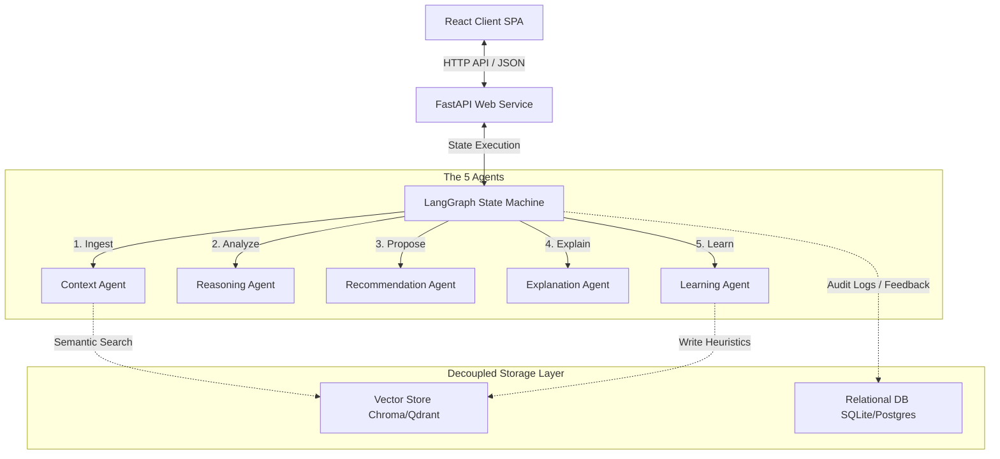
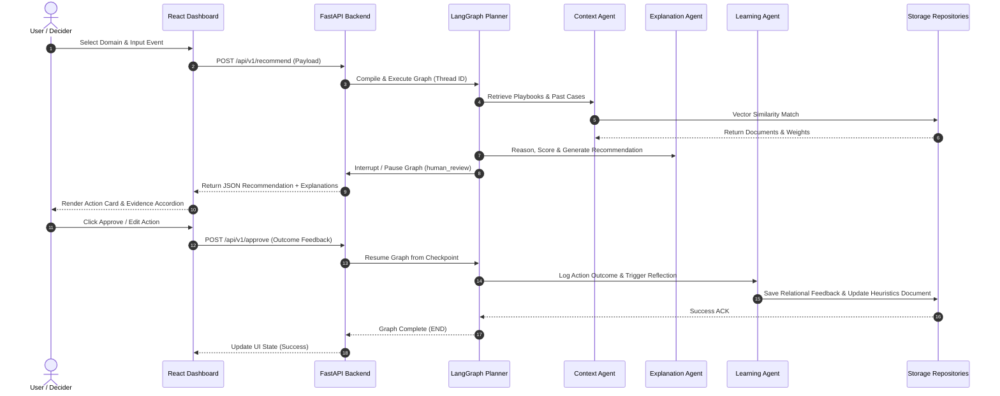

# System Architecture

The Decision Intelligence Platform is structured as a decoupled, configuration-driven multi-agent system. It segregates logic between:
1. **Frontend Dashboard (React + Vite)**: A dynamic interface to review, approve, and audit recommendations.
2. **Web API Layer (FastAPI)**: Coordinates requests, manages request tracing, and handles lifespan startup checks.
3. **Planner Agent (LangGraph)**: Compiles the state graph, manages interrupts, and coordinates agent handoffs.
4. **Memory Layer Abstraction**: Manages relational (SQLite/PostgreSQL) and semantic vector (Chroma/Qdrant) data.

---

## High-Level Architecture Block Diagram

---

## Global Execution Handoff Sequence

The diagram below details the handoff flow from the initial user event to the final feedback and learning loops.

