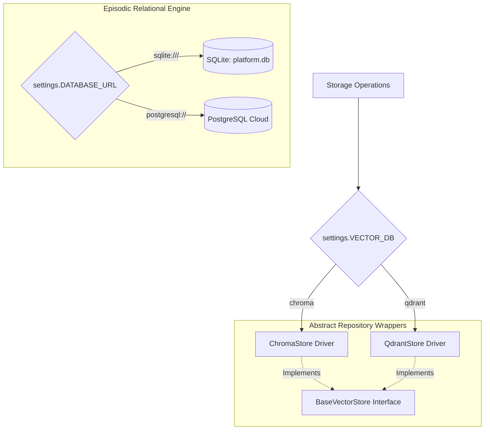
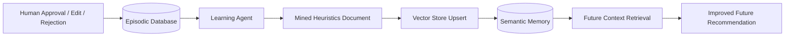

# Decoupled Memory Layer

The platform utilizes a **Dual-Core Memory Architecture** that segregates relational structured event logs (**Episodic Memory**) from high-dimensional vector playbooks and heuristics (**Semantic Memory**). Both systems are decoupled from application logic using abstract repository interfaces and driver factories.

---

## 1. Dual-Core Memory System Overview



---

## 2. Episodic Memory (Relational Log & Audit Engine)

Episodic memory (`backend/memory/episodic.py`) stores historical decision logs, human feedback events, interaction feeds, and mined reflection heuristics.

### 2.1 Database Drivers
* **Development Driver**: Local file-backed SQLite database located at `backend/data/platform.db`. Uses `check_same_thread=False` and connection pooling for rapid local iteration.
* **Production Driver**: Managed PostgreSQL instance (e.g. AWS RDS or Supabase). Automatically configured when `DATABASE_URL` starts with `postgresql://`.

### 2.2 Relational Schema & ORM Models
1. **`RecommendationRecord`**:
   - `id`: Auto-incrementing primary key.
   - `thread_id`: Unique LangGraph execution UUID.
   - `domain_pack_id`: Industry pack identifier (e.g. `customer_success`).
   - `entity_id`: Target account or candidate ID.
   - `recommended_action`: Proposed primary action title.
   - `confidence_score`: Metric float (`0.0` to `1.0`).
   - `metadata_json`: Serialized string containing citations, reasoning risks, and evidence count.
   - `created_at`: Timestamp of recommendation generation.
2. **`FeedbackRecord`**:
   - `id`: Primary key.
   - `thread_id`: Foreign key referencing the execution thread.
   - `outcome`: Decision choice (`approved`, `edited`, `rejected`).
   - `feedback_text`: Decider's written comments/notes.
   - `edited_action_json`: Modified action payload (if edited).
   - `created_at`: Timestamp of decision.
3. **`ReflectedHeuristicRecord`**:
   - `id`: Primary key.
   - `domain_pack_id`: Domain namespace.
   - `heuristic_text`: Auto-generated guideline text mined by Learning Agent.
   - `source_outcomes_count`: Number of past feedback entries analyzed.
   - `created_at`: Timestamp of reflection.
4. **`InteractionRecord`**:
   - `interaction_id`: Unique event string (`int_001`).
   - `entity_id`: Associated account/candidate ID.
   - `interaction_type`: Type (`meeting_note`, `email`, `support_ticket`, `product_usage`).
   - `source`, `title`, `content`: Human-readable event content.
   - `signals`: Array of mined business signals.
   - `impact_score`, `planner_classification_before`, `planner_classification_after`: Deltas and routes.
5. **`RecommendationEvolution`**:
   - `evolution_id`: Evolution record primary key.
   - `interaction_id`: Triggering interaction ID.
   - `recommendation_before_json`, `recommendation_after_json`: Structured diff snapshots.

---

## 3. Semantic Memory (Vector Store Engine)

Semantic memory (`backend/memory/semantic.py`) provides high-dimensional vector search across playbook rules, domain guidelines, and mined dynamic heuristics.

### 3.1 Embeddings Model
Uses `sentence-transformers/all-MiniLM-L6-v2` (384 dimensions) for embedding text content into dense vectors. Embeddings are generated locally during ingestion and query execution.

### 3.2 Storage Drivers & Factory Abstraction
The application accesses vector storage through `get_vector_store()` (`backend/vectorstores/factory.py`), switching backends seamlessly based on `settings.VECTOR_DB`:

1. **ChromaDB (`ChromaStore`)**:
   - **Use Case**: Default local development driver.
   - **Path**: `backend/data/chroma`.
   - **Features**: In-process PersistentClient requiring zero external services. Auto-creates collection namespaces (`domain_customer_success`, `domain_recruitment`).
2. **Qdrant (`QdrantStore`)**:
   - **Use Case**: Production cloud deployment.
   - **Connection**: Connects via `settings.QDRANT_URL` and `settings.QDRANT_API_KEY`, or local storage path if URL is omitted.
   - **ID Normalization**: Standardizes string document IDs (e.g. `cb_playbook_001`) into Qdrant-compliant UUIDv5 namespaces to prevent schema errors.

### 3.3 Public API Surface
```python
add_documents(domain_pack_id: str, docs: List[Dict[str, Any]]) -> int
query(domain_pack_id: str, query_text: str, k: int = 3) -> List[Dict[str, Any]]
delete(domain_pack_id: str, document_ids: List[str]) -> bool
clear_collection(domain_pack_id: str) -> bool
get_document_by_id(domain_pack_id: str, doc_id: str) -> dict
is_healthy() -> bool
```

---

## 4. Closed-Loop Learning & Reflection Sequence

The platform updates its semantic memory dynamically based on human decider feedback without requiring manual playbook editing:



### Reflection Lifecycle:
1. Every approved, edited, or rejected recommendation writes a `FeedbackRecord` to SQLite/Postgres.
2. When `POST /api/v1/reflect` or `learning_node` runs, the Learning Agent queries past feedback records.
3. The agent clusters decision patterns (e.g. "Deciders consistently reject aggressive price increases for churn-risk clients").
4. The agent distills these patterns into a new **Reflected Heuristics Document** and upserts it into the domain's vector collection.
5. On subsequent runs, the **Context Agent** retrieves this dynamic heuristic document alongside base playbooks, automatically adjusting future confidence scores and actions!
