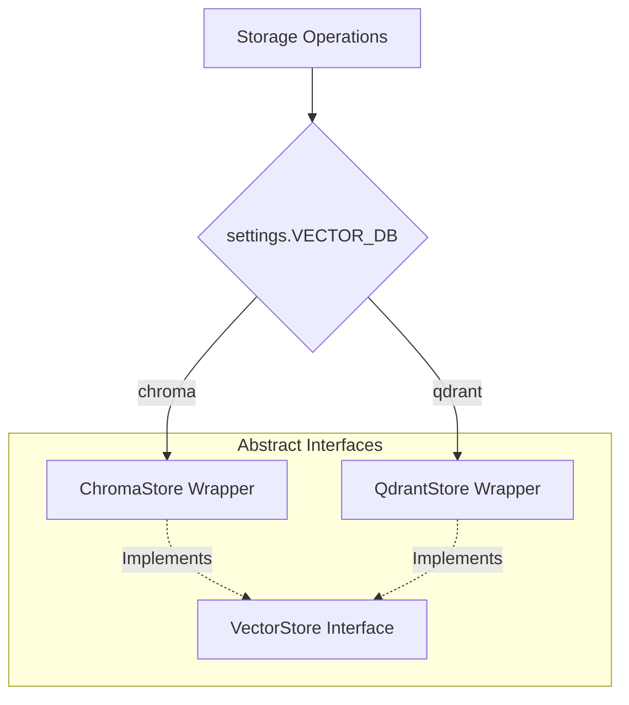

# Decoupled Memory Layer

The platform maintains two distinct memory structures, isolated from agents via repository interfaces.

---

## 1. Episodic Memory (Relational)

Stores structured historical traces: recommendations proposed, confidence matrices, human feedback choices (approved, edited, rejected), and mining reflections.

* **Development Target**: Local file-based SQLite database (`backend/data/platform.db`).
* **Production Target**: Centralized PostgreSQL service.
* **ORM Mapping**: SQLAlchemy maps schemas (`Recommendation`, `Feedback`, `ReflectedHeuristic`) dynamically. Migration support is enabled out-of-the-box.

---

## 2. Semantic Memory (Vector Database)

Stores playbooks, documents, and dynamic heuristics. Retrieves related documents using text similarity embeddings (`all-MiniLM-L6-v2`).

* **Development Target**: In-process ChromaDB service.
* **Production Target**: Remotely-hosted Qdrant cloud cluster.
* **ID Normalization**: Standardizes arbitrary string document IDs to Qdrant-compatible UUIDs deterministically using namespaces.

---

## Storage Abstraction Factory

Both storage layers are initialized at runtime using the `get_vector_store()` and database session factory interfaces.

---

## Memory Flow and Closed-Loop Learning

Dynamic learning allows feedback metrics to modify future recommendations:

