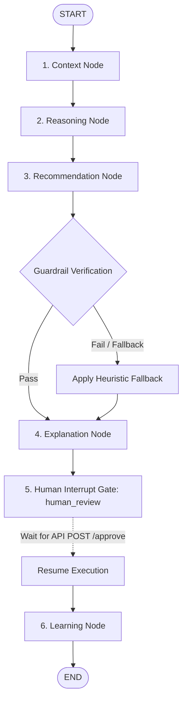

# Planner Agent Orchestration

The **Planner Agent** serves as the central brain and workflow engine of the platform. Implemented using **LangGraph (v0.2.x)**, it models multi-agent orchestration as a state-machine graph where nodes represent specialized agent invocations, edges manage conditional routing, and checkpointers enable human-in-the-loop state persistence.

---

## 1. Graph State Schema (`PlatformState`)

The global execution state is preserved across steps using a typed Pydantic/TypedDict state dictionary (`backend/core/state.py`):

```python
class PlatformState(TypedDict):
    account: Dict[str, Any]                  # Selected entity payload (ACV, health score, metrics)
    domain_pack: Dict[str, Any]              # Active domain pack configuration rules
    interaction_notes: str                   # Raw or ingested text input
    retrieved_context: Dict[str, Any]        # Playbook citations, feedback cases, and heuristics
    reasoning_output: Dict[str, Any]         # Identified risks, opportunities, and conflicts
    recommendation_output: Dict[str, Any]    # Candidate actions, selected proposal, guardrail status
    explanation_output: Dict[str, Any]       # Confidence score matrix, evidence count, logic trace
    human_decision: Dict[str, Any]           # Outcome (approved/edited/rejected), edited action, feedback
    learning_output: Dict[str, Any]          # Reflection results and updated vector heuristic document IDs
    metadata: Dict[str, Any]                 # Execution metrics (latency, LLM calls, step timings)
```

---

## 2. Graph Compilation & Node Architecture

The state graph compiles the following execution chain:



### Node Descriptions:
1. **`context_node`**: Invokes the Context Agent to perform vector similarity queries against ChromaDB/Qdrant, retrieving relevant playbooks, dynamic heuristics, and past case outcomes.
2. **`reasoning_node`**: Invokes the Reasoning Agent to analyze account health, usage trends, and incoming signals. Extracts risks, opportunities, and checks for operational conflicts.
3. **`recommendation_node`**: Invokes the Recommendation Agent to select candidate actions from domain playbooks, structure the primary recommendation, and execute the Recommendation Guard.
4. **`explanation_node`**: Invokes the Explanation Agent to compute confidence scores (incorporating source agreement, evidence count, and past case acceptance rates) and generate transparent traces.
5. **`human_review` (Interrupt Gate)**: A checkpoint boundary where graph execution pauses before writing to memory.
6. **`learning_node`**: Invokes the Learning Agent after human approval/rejection to record decisions in SQLite/PostgreSQL and update dynamic heuristic documents.

---

## 3. Human Interrupt Gate Mechanism

The workflow graph is compiled with a thread checkpointer (`MemorySaver`) and explicit interrupt rules:

```python
workflow = StateGraph(PlatformState)

# Node registration
workflow.add_node("context_node", context_node)
workflow.add_node("reasoning_node", reasoning_node)
workflow.add_node("recommendation_node", recommendation_node)
workflow.add_node("explanation_node", explanation_node)
workflow.add_node("human_review", human_review_node)
workflow.add_node("learning_node", learning_node)

# Edge wiring
workflow.add_edge(START, "context_node")
workflow.add_edge("context_node", "reasoning_node")
workflow.add_edge("reasoning_node", "recommendation_node")
workflow.add_edge("recommendation_node", "explanation_node")
workflow.add_edge("explanation_node", "human_review")
workflow.add_edge("human_review", "learning_node")
workflow.add_edge("learning_node", END)

# Checkpointer & Interrupt Gate
memory = MemorySaver()
graph = workflow.compile(checkpointer=memory, interrupt_before=["human_review"])
```

### How the Interrupt Gate Operates:
1. When `POST /api/v1/recommend` is called, FastAPI generates a unique `thread_id` UUID and executes `graph.invoke(initial_state, config={"configurable": {"thread_id": thread_id}})` .
2. The graph executes `context_node` ➔ `reasoning_node` ➔ `recommendation_node` ➔ `explanation_node` and **pauses automatically** at `human_review`.
3. The API server captures the state snapshot and returns the confidence-scored recommendation payload to the React frontend.
4. When the user reviews the action and submits approval via `POST /api/v1/approve`, the server passes the decision payload into `graph.update_state(config, {"human_decision": decision})` and calls `graph.invoke(None, config)` to resume graph execution into `learning_node`.

---

## 4. Execution Safety & Loop Control

To guarantee stability in production, the planner incorporates strict execution guardrails (`backend/core/constants.py`):

* **Max Graph Depth (`MAX_GRAPH_DEPTH = 10`)**: Prevents recursive routing loops from running infinitely.
* **Max Agent Executions (`MAX_AGENT_EXECUTIONS = 20`)**: Caps total agent step invocations per thread request.
* **Request LLM Call Budget (`MAX_LLM_CALLS_PER_REQUEST = 5`)**: Tracks and restricts API calls to OpenRouter to prevent quota exhaustion.
* **Timeout Enforcement (`LLM_TIMEOUT_SECONDS = 20`)**: Wraps agent LLM requests with strict timeouts, triggering rule-based fallbacks if endpoints delay.

---

## 5. Interaction-Driven Recommendation Evolution

When a new real-time event (e.g. meeting note or support escalation) is submitted via `POST /api/v1/interactions`:
1. The **Interaction Analyzer** extracts business signals.
2. The **Impact Assessment Engine** calculates operational risk/opportunity deltas.
3. The **Planner Reclassifies** the entity state (e.g. from `standard` to `escalation`).
4. The Planner automatically re-executes the state graph with the new interaction context.
5. The backend stores the previous vs current recommendation state in SQLite/Postgres and returns a **Recommendation Evolution Diff** payload to the UI, highlighting what changed and why.
