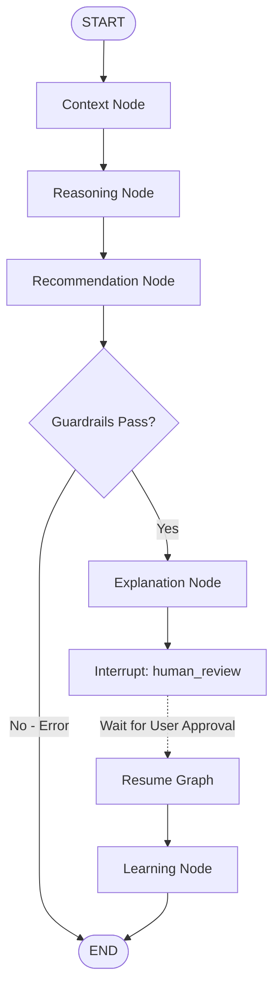

# Planner Agent Orchestration

The system uses **LangGraph** to coordinate steps. It models agent coordination as a state-machine graph, where nodes represent agent invocations and edges manage routing.

---

## State Schema (`PlatformState`)

The global execution state is preserved across steps using a typed state dict:

```python
class PlatformState(TypedDict):
    account: Dict[str, Any]
    domain_pack: Dict[str, Any]
    interaction_notes: str
    retrieved_context: Dict[str, Any]
    reasoning_output: Dict[str, Any]
    recommendation_output: Dict[str, Any]
    explanation_output: Dict[str, Any]
    human_decision: Dict[str, Any]
    learning_output: Dict[str, Any]
    metadata: Dict[str, Any]
```

---

## Graph Compilation Flow

The graph defines the execution chain:
1. **Context Phase**: Loads domain pack details and queries semantic vectors.
2. **Reasoning Phase**: Mines situation risks/opportunities and detects conflicts.
3. **Recommendation Phase**: Proposes action options and runs guardrails.
4. **Explanation Phase**: Computes confidence factors and generates traces.
5. **Human Gate Interrupt**: Pauses execution to wait for user input.
6. **Learning Phase**: Mines feedback loops and writes back dynamic heuristics.



---

## Human Interrupt Gate Rationale

By defining the state machine with:
```python
workflow.compile(checkpointer=memory, interrupt_before=["learning_node"])
```
The application compiles a checkpoint at step 5. The API server returns the current state immediately without running the learning node. When the administrator approves or edits the action via `/api/v1/approve`, the server loads the checkpoint via the unique `thread_id` and resumes execution into the `learning_node` cleanly.
