# Intelligent Next Best Action Platform
### XLVentures.AI Hackathon Submission

[](https://github.com/Akash-paluvai/XLVentures/actions)
[](https://www.python.org/)
[](https://react.dev/)
[](https://www.docker.com/)
[](https://opensource.org/licenses/MIT)

> A **reusable, configuration-driven Decision Intelligence Platform** that transforms customer interactions and enterprise knowledge into explainable, confidence-scored next best action recommendations — with a human-in-the-loop approval gate and continuous learning from feedback.

---

## ▶ Watch Platform Demo
To view the platform execution loop and see how recommendations pause for human decisions, watch the recorded session walk-through:


---

## Table of Contents
1. [Platform Overview](#1-platform-overview)
2. [Visual Tour & Real Screenshots](#2-visual-tour--real-screenshots)
3. [Repository Structure](#3-repository-structure)
4. [Technology Stack & Abstractions](#4-technology-stack--abstractions)
5. [Architecture Decision Records (ADRs)](#5-architecture-decision-records-adrs)
6. [Core System Diagrams](#6-core-system-diagrams)
7. [Engineering Trade-offs](#7-engineering-trade-offs)
8. [Future Roadmap](#8-future-roadmap)
9. [Detailed Document Directory](#9-detailed-document-directory)

---

## 1. Platform Overview

The system implements a structured **Decision Intelligence Pipeline**:

```
Input Data ➔ Context Enrichment ➔ Situation Reasoning ➔
Candidate Proposal ➔ Confidence Scoring ➔ Human Interrupt Gate ➔ Feedback Learning
```

### Key Capabilities
* **Domain-Agnostic Engine**: Run different industry frameworks (e.g. Customer Success vs Recruitment) purely via configuration packs, requiring no code modifications.
* **Evidence-Based Confidence**: Generates metric-driven confidence scores from retrieved playbook citations, past case acceptance rates, and semantic alignment weights.
* **Hardened Human Gate**: Utilizes LangGraph checkpoints to freeze state execution before recommendation fulfillment, allowing users to Approve, Reject, or Edit actions.

---

## 2. Visual Tour & Real Screenshots

### Recommendation Dashboard
Main user interface displaying active client situations, primary action proposals, and evidence weights.
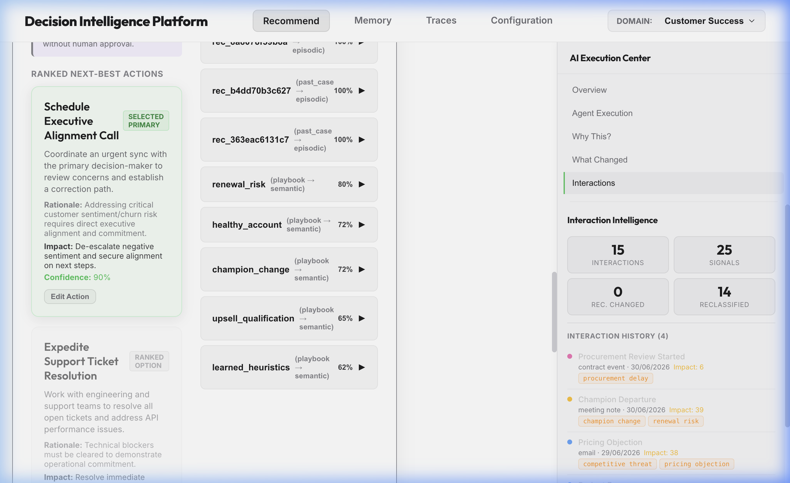

### Human-in-the-loop Execution Gate
Interrupt panel allowing deciders to review reasoning, edit the action, or submit final decisions.
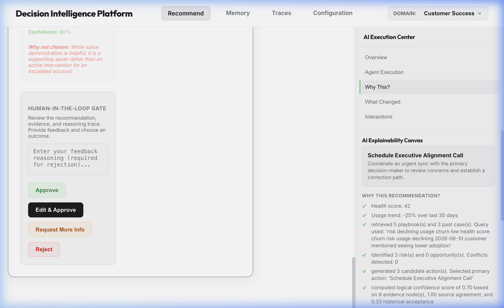

### Multi-Agent Trace Canvas
Visual path detailing chronological handoffs from context retrieval to learning reflection.
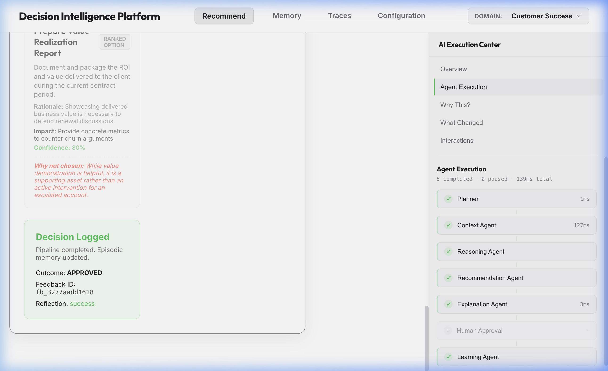

### Semantic Memory Dashboard
Search console logging vector playbooks, heuristics documents, and cosine retrieval scores.
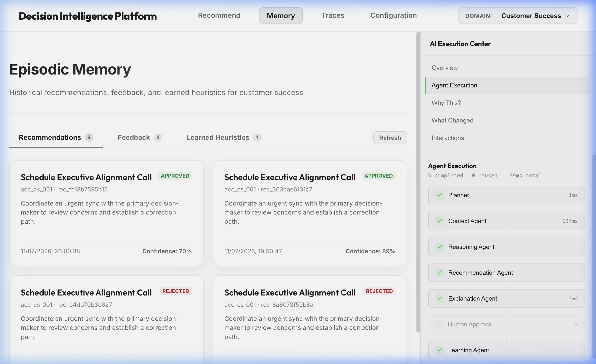

---

## 3. Repository Structure

```text
.
├── .github/workflows/ci.yml       # GitHub Actions Quality Gates
├── .pre-commit-config.yaml        # Local git verification hooks
├── pyproject.toml                 # Central tool parameters (Ruff, Black)
├── railway.json                   # Backend cloud build settings
├── Dockerfile                     # Single-stage cached container
├── docker-compose.yml             # Local services topology
├── Makefile                       # Developer automation scripts
├── requirements.txt               # Backend Python requirements
├── backend/
│   ├── api/                       # FastAPI router and lifespan middleware
│   ├── core/                      # Planner, schemas, settings, and LLM clients
│   ├── agents/                    # The 5 agent implementations
│   ├── memory/                    # Episodic DB and manager interfaces
│   ├── vectorstores/              # Decoupled database drivers
│   ├── security/                  # PII filters and prompt injection guards
│   └── scripts/                   # Seeding tools and pipeline tests
├── frontend/
│   ├── src/                       # React modules (Zustand store, hooks)
│   ├── package.json               # Frontend JS scripts and packages
│   └── vite.config.js             # Vite configuration settings
└── docs/                          # In-depth architectural files
```

---

## 4. Technology Stack & Abstractions

The repository is built on a modular driver design. You can swap storage engines instantly via configuration flags.

* **Core Orchestrator**: LangGraph (v0.2.x) with MemorySaver checkpointers.
* **API Service**: FastAPI + Pydantic Settings (v2) configuration management.
* **Client Frontend**: React 19 + Zustand state hooks + Vanilla CSS.

### Storage Drivers
* **Relational DB**: [episodic.py](file:///Users/akashpaluvai/college/agenticplatform/XLVenturesHackathon/backend/memory/episodic.py) (SQLAlchemy repository).
  * **Development**: SQLite (`backend/data/platform.db`).
  * **Production**: PostgreSQL (Auto-schema creation).
* **Vector Store**: [factory.py](file:///Users/akashpaluvai/college/agenticplatform/XLVenturesHackathon/backend/vectorstores/factory.py).
  * **Development**: ChromaDB (In-memory file system).
  * **Production**: Qdrant Cloud Cluster.

---

## 5. Architecture Decision Records (ADRs)
Our engineering design choices are documented in standard ADR templates:
* [ADR 001: Why LangGraph](file:///Users/akashpaluvai/college/agenticplatform/XLVenturesHackathon/docs/adr/001-why-langgraph.md) - Rationale for cycles, persistence, and pauses.
* [ADR 002: Why FastAPI](file:///Users/akashpaluvai/college/agenticplatform/XLVenturesHackathon/docs/adr/002-why-fastapi.md) - Benefits of async concurrency and OpenAPI.
* [ADR 003: Why React](file:///Users/akashpaluvai/college/agenticplatform/XLVenturesHackathon/docs/adr/003-why-react.md) - Dynamic client views and lightweight states.
* [ADR 004: Why Vector Memory Abstraction](file:///Users/akashpaluvai/college/agenticplatform/XLVenturesHackathon/docs/adr/004-why-vector-memory.md) - Decoupling database wrappers from core agents.

---

## 6. Core System Diagrams

### System Architecture
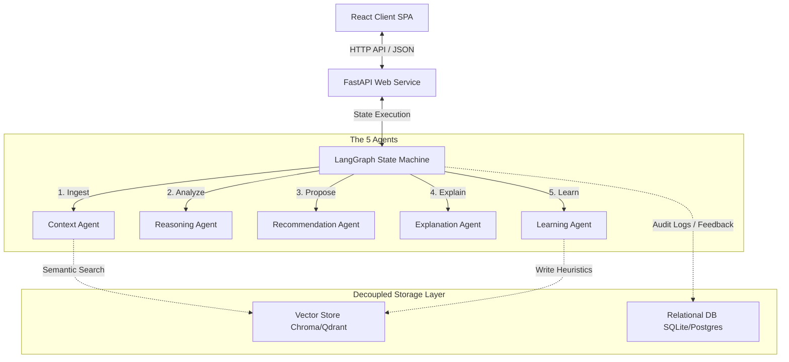

### Deployment Architecture
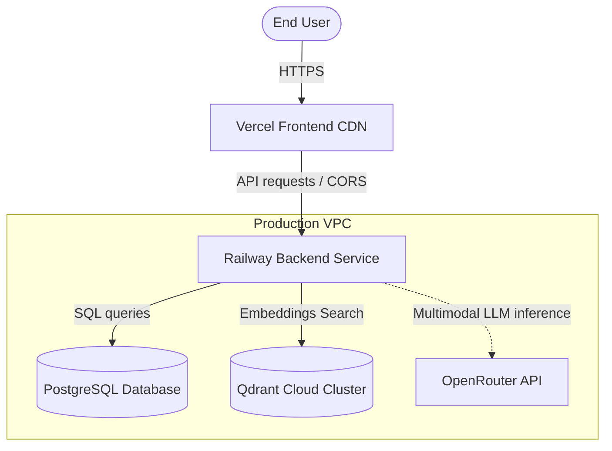

### Agent Flow
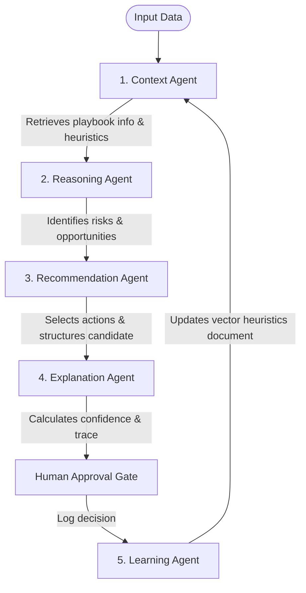

### Planner Flow
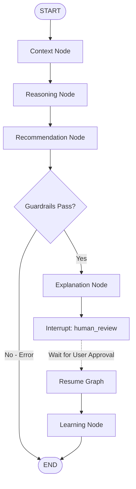

### Sequence Diagram
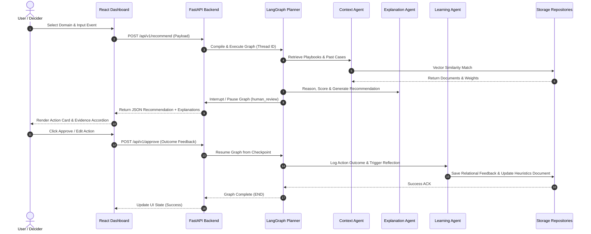

### Memory Flow
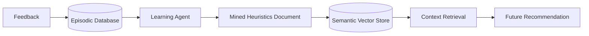

### Recommendation Lifecycle
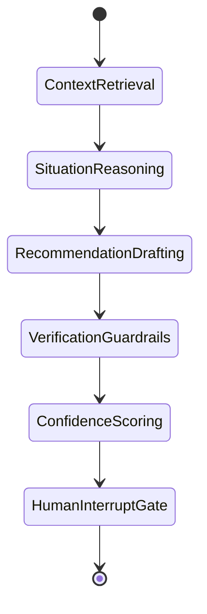

### Interaction Lifecycle
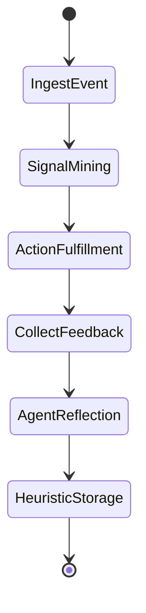

---

## 7. Engineering Trade-offs

During implementation, we balanced operational convenience with enterprise requirements:

### 1. SQLite + ChromaDB vs. PostgreSQL + Qdrant
* **Trade-off**: Simple, fast local setups vs. scalable enterprise services.
* **Choice**: We implemented an **abstract database factory design**. The platform runs by default on Chroma and SQLite for zero-setup portability, but shifts to PostgreSQL and Qdrant in staging/production via environment keys.

### 2. Single-Stage Docker Image vs. Multi-Stage Builds
* **Trade-off**: Image size minimization vs. layer dependency caching speed.
* **Choice**: Since our backend is Python-only, multi-stage compilation provides minimal value. We chose a simple, unified `Dockerfile` utilizing non-root users, security limits, and package caching.

---

## 8. Future Roadmap
* **Distributed Locking (Redis)**: Prevent duplicate thread runs on double clicks.
* **Live Streaming Logs**: Push agent execution updates to UI using WebSockets.
* **Multi-tenant isolation**: Encrypt memory keys to allow multi-company scoping.
* **Role-Based Access Control (RBAC)**: Restrict approve rights to specific human users.

---

## 9. Detailed Document Directory
For more details, view the individual documentation files:
* [Architecture Guide](file:///Users/akashpaluvai/college/agenticplatform/XLVenturesHackathon/docs/architecture.md)
* [Planner Configuration](file:///Users/akashpaluvai/college/agenticplatform/XLVenturesHackathon/docs/planner.md)
* [Memory Wrappers](file:///Users/akashpaluvai/college/agenticplatform/XLVenturesHackathon/docs/memory.md)
* [Agent Specs](file:///Users/akashpaluvai/college/agenticplatform/XLVenturesHackathon/docs/agents.md)
* [Cloud Deployment](file:///Users/akashpaluvai/college/agenticplatform/XLVenturesHackathon/docs/deployment.md)

---

## License
Distributed under the MIT License. See [LICENSE](LICENSE) for more information.
